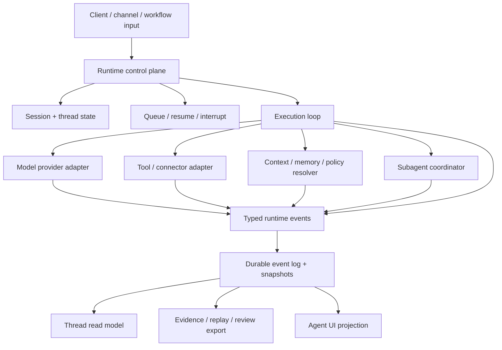

# Specification

Agent Runtime latest draft is a portable standard draft for agent execution. The core contract is the boundary between execution facts and consumers such as UI, replay, review, telemetry, workflow, and remote channels.

Agent Runtime owns execution facts. It does not own the visual surface, provider API, external tool protocol, artifact bytes, evidence verdict, memory source, or host account model.

## Scope

Agent Runtime standardizes these implementation concerns:

1. Runtime identity and correlation ids.
2. Event classes and event envelope fields.
3. Control plane actions and required write boundaries.
4. Durable snapshots and read models.
5. Tool/context/model/policy orchestration facts.
6. Human-in-the-loop requests and queue/resume semantics.
7. Evidence, replay, and observability export boundaries.
8. Permission, sandbox, hooks, process execution, and remote recovery.
9. Model routing, candidate sets, cost, quota, rate limit, and budget facts.
10. Subagent graphs, background jobs, large output storage, and session reconstruction.

Agent Runtime does **not** standardize a UI component model, model provider protocol, tool registry format, workflow language, vector store, artifact format, or observability backend.

## Pressure From Real Runtimes

Agent Runtime is not a wrapper around chat streaming. Real implementations show ten facts that must be first-class:

1. Tool calls have schema, progress, partial output, permission gates, hooks, result refs, and failure categories.
2. Command execution has cwd, sandbox, network, stdin/stdout, exit code, output buffers, and long-running process state.
3. Permission decisions come from modes, rules, hooks, classifiers, humans, and host policy. Deny/ask rules must be able to override automatic allow.
4. Hooks are governance points and must write runtime facts, not create a side execution path.
5. Context compaction, rollback, and reconstruction need explicit boundaries.
6. Subagents need a parent-child graph, isolation, status, and recoverable child threads.
7. Jobs need item status, attempts, assignment, and progress.
8. Remote channels need identity, resume cursors, permission bridges, and disconnect semantics.
9. Model routing needs task profiles, candidate sets, decisions, fallback, single-candidate, and no-candidate facts.
10. Cost, quota, rate limits, request telemetry, and evidence must join through stable correlation ids.

## Execution architecture

The runtime may keep internal provider-native records, but external consumers SHOULD receive normalized runtime events and snapshots.

## Required identity model

| Identity | Meaning | Required relationship |
| --- | --- | --- |
| `runtime_id` | Runtime installation or service instance. | Stable enough for trace attribution. |
| `session_id` | Durable user-visible work container. | Owns one or more threads. |
| `thread_id` | Ordered execution context. | Belongs to one session. |
| `turn_id` | One submitted input cycle. | Belongs to one thread. |
| `task_id` | Unit of work that may span turns or run in background. | Belongs to a thread or parent task. |
| `step_id` | Ordered runtime item, such as status, message, tool, artifact, or action. | Belongs to a turn or task. |
| `tool_call_id` | One tool invocation. | Belongs to a step and may have result refs. |
| `action_id` | One pending human or policy decision. | Belongs to a turn, task, or tool call. |
| `subagent_id` | Child agent execution context. | Has parent session/thread/turn links. |
| `artifact_id` | Durable deliverable reference. | Owned by artifact service; referenced by runtime. |
| `evidence_id` | Trace, replay, verification, or review reference. | Owned by evidence system; referenced by runtime. |

A compatible implementation MUST NOT rely on a single message id to represent all runtime work.

## Event envelope

Every emitted event SHOULD include:

| Field | Requirement |
| --- | --- |
| `type` | Required event class. |
| `event_id` | Required unique event id. |
| `timestamp` | Required producer timestamp. |
| `sequence` | Monotonic within a stream when possible. |
| `schema_version` | Runtime event schema version. |
| `session_id`, `thread_id`, `turn_id` | Present whenever the event belongs to a thread or turn. |
| `task_id`, `step_id`, `tool_call_id`, `action_id`, `subagent_id` | Present when applicable. |
| `trace_id`, `span_id` | Present when telemetry is available. |
| `payload` | Typed event payload. |
| `refs` | Stable references to large or owned external facts. |

Large tool outputs, artifacts, evidence packs, and raw provider payloads SHOULD be referenced, not copied into every event.

## Standard event classes

| Class | Purpose |
| --- | --- |
| `session.created` / `session.updated` | Session metadata changed. |
| `thread.started` / `thread.updated` | Thread lifecycle or read-model relevant state changed. |
| `turn.submitted` / `turn.started` / `turn.completed` / `turn.failed` | User or system turn lifecycle. |
| `task.started` / `task.updated` / `task.completed` / `task.failed` | Long-running or background task lifecycle. |
| `run.status` | Human-readable runtime status with phase, title, detail, checkpoints, and metadata. |
| `model.requested` / `model.delta` / `model.completed` / `model.failed` | Provider adapter lifecycle and text/structured output stream. |
| `reasoning.delta` / `reasoning.summary` | Reasoning or planning stream outside final text. |
| `tool.catalog.resolved` | Tool inventory or capability surface was selected for the turn. |
| `tool.started` / `tool.args` / `tool.progress` / `tool.result` / `tool.failed` | Tool invocation lifecycle. |
| `action.required` / `action.resolved` | Runtime paused for user, policy, or structured input decision. |
| `queue.changed` | Queued turns changed order, state, or policy. |
| `context.resolved` | Context, memory, knowledge, source, or policy refs selected for a turn. |
| `context.compaction.started` / `context.compaction.completed` / `context.compaction.failed` | Context compaction boundary lifecycle. |
| `artifact.changed` | Runtime observed or produced an artifact reference. |
| `evidence.changed` | Runtime observed or exported evidence/replay/review reference. |
| `subagent.spawned` / `subagent.status` / `subagent.input` / `subagent.completed` / `subagent.failed` / `subagent.closed` | Child agent coordination. |
| `limit.changed` | Cost, quota, rate limit, budget, or policy limit changed. |
| `snapshot.updated` | Durable snapshot or read model changed. |
| `runtime.warning` / `runtime.error` | Non-fatal warning or fatal runtime error. |

Implementations may add vendor-specific event types, but MUST keep the normalized classes available for portable consumers.

### Expanded Event Families

Real coding, desktop, and remote runtimes SHOULD also expose these event families:

| Family | Events | Purpose |
| --- | --- | --- |
| Permission | `permission.evaluated` / `permission.requested` / `permission.resolved` | Record how rules, modes, hooks, classifiers, humans, or host policy decided. |
| Sandbox | `sandbox.applied` / `sandbox.violation` | Record actual execution boundaries and violations. |
| Hook / policy | `hook.started` / `hook.completed` / `hook.failed` / `policy.changed` | Record governance inputs, outcomes, duration, and failure behavior. |
| Process | `process.started` / `process.output` / `process.input` / `process.completed` / `process.failed` / `process.terminated` | Record commands, PTY sessions, long-running processes, and output refs. |
| Routing | `task.profile.resolved` / `routing.candidates.resolved` / `routing.decided` / `routing.fallback.applied` / `routing.not_possible` / `routing.single_candidate` | Explain model candidates, selection, fallback, blocking, and single-candidate paths. |
| Cost / limits | `cost.estimated` / `cost.recorded` / `rate_limit.hit` / `quota.low` / `quota.blocked` | Make cost, limits, and quota runtime facts. |
| Channel | `channel.connected` / `channel.disconnected` / `channel.resumed` / `channel.message` / `channel.permission_forwarded` / `channel.permission_returned` | Record remote channels, recovery, and cross-channel approval. |
| Jobs | `job.created` / `job.started` / `job.progress` / `job.item.started` / `job.item.completed` / `job.item.failed` / `job.completed` / `job.failed` / `job.cancelled` | Record batch and background work. |
| Output | `output.spilled` / `output.truncated` / `output.redacted` / `output.expired` | Manage large output and auditable references. |
| History | `history.window.loaded` / `history.reconstructed` / `history.rollback.started` / `history.rollback.completed` / `snapshot.repaired` | Recover old sessions, compaction, and rollback. |

## Control plane

A compatible runtime SHOULD expose these commands, regardless of transport:

| Command | Required input | Result |
| --- | --- | --- |
| `submit_turn` | `session_id`, `thread_id` or create policy, input parts, options, metadata. | Accepted turn or queued turn. |
| `interrupt_turn` | `session_id`, optional `thread_id` / `turn_id`, reason. | Interrupt accepted or no-op. |
| `resume_thread` | `session_id`, `thread_id`, optional resume token. | Resume attempt result. |
| `respond_action` | `action_id`, decision, optional structured payload. | Action resolved event. |
| `remove_queued_turn` / `promote_queued_turn` | `queued_turn_id`, target session/thread. | Queue changed event. |
| `get_session` | `session_id`, history window or cursor. | Durable session snapshot. |
| `get_thread_read` | `session_id`, `thread_id`. | Thread read model. |
| `get_tool_inventory` | Scope, caller, policy, runtime mode. | Tool inventory snapshot. |
| `spawn_subagent` / `send_subagent_input` / `wait_subagents` / `resume_subagent` / `close_subagent` | Parent ids and child control payload. | Subagent lifecycle facts. |
| `export_evidence` / `export_replay` | Session/thread/turn/task scope. | Stable evidence or replay refs. |
| `evaluate_permission` / `resolve_permission` | Tool/process/action scope and decision payload. | Permission evaluated/resolved event. |
| `get_execution_environment` | Session/thread/turn scope. | Environment snapshot. |
| `write_process_stdin` / `terminate_process` | `process_id`, input, or reason. | Process input / terminated event. |
| `list_subagents` / `list_jobs` / `get_job` / `cancel_job` | Session/thread/job scope. | Subagent graph or job snapshot. |
| `reconnect_channel` / `ack_events` | Channel id, cursor, resume token. | Channel resumed or snapshot repair. |
| `export_review` | Session/thread/turn/task scope. | Review refs. |

Commands that mutate state MUST write through the runtime or owning adjacent system. UI-only state cannot mutate runtime truth.

## Durable snapshots and read models

The event stream is necessary but not enough. A compatible runtime SHOULD maintain:

- `session_snapshot`: shell, title, timestamps, threads, recent messages or steps, history cursor.
- `thread_read_model`: current status, active turn, pending requests, last outcome, incidents, queued turns, diagnostics.
- `tool_inventory_snapshot`: tools available for the current caller, policy, context, and mode.
- `queue_snapshot`: queued turn ids, order, source, policy, and resume state.
- `context_boundary_snapshot`: selected refs, compaction summaries, context warnings, missing facts.
- `artifact_checkpoint_summary`: artifact refs, versions, previews, validation issue counts, diff refs.
- `evidence_summary`: trace ids, verification outcomes, replay refs, review refs, audit notes.
- `permission_sandbox_summary`: permission state, pending approvals, sandbox profile, and violation refs.
- `execution_environment_snapshot`: cwd, workspace roots, env refs, process limits, and active processes.
- `routing_limit_summary`: task profile, candidate count, routing decision, cost state, quota/rate-limit state.
- `subagent_job_summary`: child graph, job progress, assigned threads, and recoverability.
- `channel_summary`: remote peers, resume cursors, last acknowledged sequence, and permission bridge state.

Read models may be compact. They must be honest: `unknown`, `unavailable`, `stale`, and `blocked` are better than inferred success.

## Completion and failure semantics

A runtime SHOULD distinguish:

- `accepted`: runtime received the request.
- `queued`: work is waiting behind another turn or policy gate.
- `preparing`: context, model, tools, or policy are being resolved.
- `running`: the execution loop is active.
- `blocked`: an action, credential, policy, context, tool, or quota is missing.
- `streaming`: model or tool output is being emitted.
- `retrying`: retry or fallback is active.
- `completed`: owner declared work complete and durable facts are reconciled.
- `failed`: work cannot continue without a new request or repair.
- `cancelled`: user, policy, or runtime interrupted the work.
- `stale`: known snapshot may not reflect current execution.

`success` from a provider or tool is not the same as completed agent work. Completion must be tied to runtime state and, when required, artifact or evidence facts.

## Validation

A validator SHOULD check behavior, not only file presence:

- Events contain stable ids and can be replayed into a read model.
- Provider streams map to normalized model/text/reasoning events.
- Tool calls preserve input refs, result refs, errors, and policy decisions.
- Human actions pause execution and resume only through `respond_action`.
- Queue mutations survive restart and emit `queue.changed`.
- Old sessions hydrate through snapshots and cursor windows.
- Evidence/replay exports derive from the same runtime facts as UI and diagnostics.
- Missing facts are marked `unknown`, `unavailable`, `stale`, or `blocked` instead of inferred from prose.
