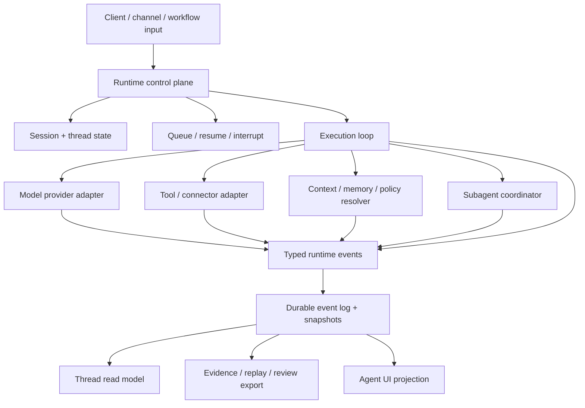

# 规范

Agent Runtime v0.1 是面向 Agent 执行层的可移植草案标准。核心契约是 execution facts 与 UI、replay、review、telemetry、workflow、remote channels 等消费者之间的边界。

Agent Runtime 拥有执行事实。它不拥有视觉表面、provider API、外部工具协议、artifact bytes、evidence verdict、memory source 或宿主账号模型。

## 范围

Agent Runtime 标准化这些实现问题：

1. Runtime identity 和 correlation ids。
2. Event classes 和 event envelope fields。
3. Control plane actions 与必需写入边界。
4. Durable snapshots 和 read models。
5. Tool/context/model/policy orchestration facts。
6. Human-in-the-loop requests 与 queue/resume semantics。
7. Evidence、replay 和 observability export boundaries。
8. 面向真实 Agent 执行的验收场景。

Agent Runtime **不**标准化 UI 组件模型、模型供应商协议、工具注册表格式、工作流语言、vector store、artifact format 或 observability backend。

## 执行架构

Runtime 可以保留 provider-native 内部记录，但外部消费者 SHOULD 接收 normalized runtime events 和 snapshots。

## 必需 identity model

| Identity | 含义 | 必需关系 |
| --- | --- | --- |
| `runtime_id` | Runtime 安装或服务实例。 | 足够稳定，可用于 trace attribution。 |
| `session_id` | 用户可见的 durable work container。 | 拥有一个或多个 threads。 |
| `thread_id` | 有序执行上下文。 | 属于一个 session。 |
| `turn_id` | 一次提交输入周期。 | 属于一个 thread。 |
| `task_id` | 可跨 turn 或后台运行的工作单元。 | 属于 thread 或 parent task。 |
| `step_id` | 有序 runtime item，例如 status、message、tool、artifact 或 action。 | 属于 turn 或 task。 |
| `tool_call_id` | 一次工具调用。 | 属于 step，可有 result refs。 |
| `action_id` | 一次 pending human 或 policy decision。 | 属于 turn、task 或 tool call。 |
| `subagent_id` | 子代理执行上下文。 | 有 parent session/thread/turn links。 |
| `artifact_id` | durable deliverable reference。 | 由 artifact service 拥有，runtime 引用。 |
| `evidence_id` | trace、replay、verification 或 review reference。 | 由 evidence system 拥有，runtime 引用。 |

兼容实现 MUST NOT 用单一 message id 表示所有 runtime work。

## Event envelope

每个 event SHOULD 包含：

| Field | 要求 |
| --- | --- |
| `type` | 必需 event class。 |
| `event_id` | 必需唯一 event id。 |
| `timestamp` | 必需 producer timestamp。 |
| `sequence` | 在同一 stream 内尽量单调递增。 |
| `schema_version` | Runtime event schema version。 |
| `session_id`、`thread_id`、`turn_id` | 属于 thread 或 turn 时必须出现。 |
| `task_id`、`step_id`、`tool_call_id`、`action_id`、`subagent_id` | 适用时出现。 |
| `trace_id`、`span_id` | telemetry 可用时出现。 |
| `payload` | typed event payload。 |
| `refs` | 指向大 payload 或相邻 owner facts 的稳定 references。 |

大工具输出、artifacts、evidence packs 和原始 provider payloads SHOULD 用 ref 表示，而不是复制到每个 event。

## 标准 event classes

| Class | 目的 |
| --- | --- |
| `session.created` / `session.updated` | Session metadata 变更。 |
| `thread.started` / `thread.updated` | Thread lifecycle 或 read-model 相关状态变更。 |
| `turn.submitted` / `turn.started` / `turn.completed` / `turn.failed` | 用户或系统 turn 生命周期。 |
| `task.started` / `task.updated` / `task.completed` / `task.failed` | 长任务或后台任务生命周期。 |
| `run.status` | 带 phase、title、detail、checkpoints 和 metadata 的 runtime 状态。 |
| `model.requested` / `model.delta` / `model.completed` / `model.failed` | Provider adapter 生命周期与 text/structured output stream。 |
| `reasoning.delta` / `reasoning.summary` | 最终文本之外的 reasoning 或 planning stream。 |
| `tool.catalog.resolved` | 本 turn 选择了 tool inventory 或 capability surface。 |
| `tool.started` / `tool.args` / `tool.progress` / `tool.result` / `tool.failed` | Tool invocation lifecycle。 |
| `action.required` / `action.resolved` | Runtime 为用户、policy 或 structured input decision 暂停。 |
| `queue.changed` | Queued turns 的顺序、状态或策略变更。 |
| `context.resolved` | 为 turn 选择了 context、memory、knowledge、source 或 policy refs。 |
| `context.compaction.started` / `context.compaction.completed` / `context.compaction.failed` | Context compaction boundary 生命周期。 |
| `artifact.changed` | Runtime 观察到或产生 artifact reference。 |
| `evidence.changed` | Runtime 观察到或导出 evidence/replay/review reference。 |
| `subagent.spawned` / `subagent.status` / `subagent.input` / `subagent.completed` / `subagent.failed` / `subagent.closed` | Child agent coordination。 |
| `limit.changed` | Cost、quota、rate limit、budget 或 policy limit 变更。 |
| `snapshot.updated` | Durable snapshot 或 read model 变更。 |
| `runtime.warning` / `runtime.error` | 非致命 warning 或致命 runtime error。 |

实现可以增加 vendor-specific event types，但必须保留 normalized classes 供可移植消费者使用。

## Control plane

兼容 runtime SHOULD 暴露这些命令，无论传输层是什么：

| Command | 必需输入 | 结果 |
| --- | --- | --- |
| `submit_turn` | `session_id`、`thread_id` 或创建策略、input parts、options、metadata。 | Accepted turn 或 queued turn。 |
| `interrupt_turn` | `session_id`，可选 `thread_id` / `turn_id`，reason。 | Interrupt accepted 或 no-op。 |
| `resume_thread` | `session_id`、`thread_id`，可选 resume token。 | Resume attempt result。 |
| `respond_action` | `action_id`、decision、可选 structured payload。 | Action resolved event。 |
| `remove_queued_turn` / `promote_queued_turn` | `queued_turn_id`、目标 session/thread。 | Queue changed event。 |
| `get_session` | `session_id`、history window 或 cursor。 | Durable session snapshot。 |
| `get_thread_read` | `session_id`、`thread_id`。 | Thread read model。 |
| `get_tool_inventory` | Scope、caller、policy、runtime mode。 | Tool inventory snapshot。 |
| `spawn_subagent` / `send_subagent_input` / `wait_subagents` / `resume_subagent` / `close_subagent` | Parent ids 和 child control payload。 | Subagent lifecycle facts。 |
| `export_evidence` / `export_replay` | Session/thread/turn/task scope。 | Stable evidence 或 replay refs。 |

会修改状态的命令 MUST 通过 runtime 或相邻 owner 系统写入。UI-only state 不能修改 runtime truth。

## Durable snapshots 与 read models

Event stream 必要但不充分。兼容 runtime SHOULD 维护：

- `session_snapshot`：shell、title、timestamps、threads、recent messages 或 steps、history cursor。
- `thread_read_model`：current status、active turn、pending requests、last outcome、incidents、queued turns、diagnostics。
- `tool_inventory_snapshot`：当前 caller、policy、context、mode 下可用的 tools。
- `queue_snapshot`：queued turn ids、order、source、policy 和 resume state。
- `context_boundary_snapshot`：selected refs、compaction summaries、context warnings、missing facts。
- `artifact_checkpoint_summary`：artifact refs、versions、previews、validation issue counts、diff refs。
- `evidence_summary`：trace ids、verification outcomes、replay refs、review refs、audit notes。

Read model 可以紧凑，但必须诚实：`unknown`、`unavailable`、`stale`、`blocked` 优于从正文推断成功。

## Completion 与 failure semantics

Runtime SHOULD 区分：

- `accepted`：runtime 收到请求。
- `queued`：工作在另一个 turn 或 policy gate 后等待。
- `preparing`：正在解析 context、model、tools 或 policy。
- `running`：execution loop 活跃。
- `blocked`：缺少 action、credential、policy、context、tool 或 quota。
- `streaming`：model 或 tool output 正在发出。
- `retrying`：retry 或 fallback 活跃。
- `completed`：owner 声明完成且 durable facts 已 reconcile。
- `failed`：没有新请求或修复时无法继续。
- `cancelled`：user、policy 或 runtime 中断了工作。
- `stale`：已知 snapshot 可能不是当前执行状态。

Provider 或 tool 的 `success` 不等于 Agent 工作 completed。Completion 必须绑定 runtime state；必要时还要绑定 artifact 或 evidence facts。

## 校验

Validator SHOULD 校验行为，而不只是检查文件存在：

- Events 包含稳定 ids，并可 replay 成 read model。
- Provider streams 能映射到 normalized model/text/reasoning events。
- Tool calls 保留 input refs、result refs、errors 和 policy decisions。
- Human actions 会暂停执行，并且只通过 `respond_action` 恢复。
- Queue mutations 能跨重启保存并发出 `queue.changed`。
- 旧 sessions 通过 snapshots 和 cursor windows 恢复。
- Evidence/replay exports 来自与 UI 和 diagnostics 相同的 runtime facts。
- Missing facts 标为 `unknown`、`unavailable`、`stale` 或 `blocked`，而不是从正文推断。
