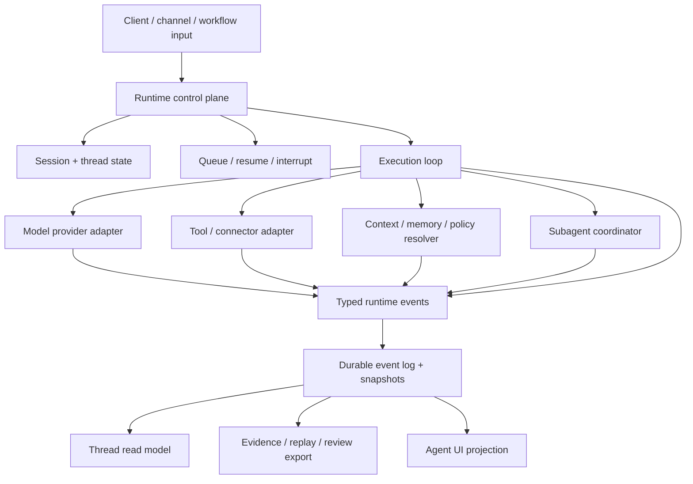

# 规范

Agent Runtime 最新草案是面向 Agent 执行层的可移植草案标准。核心契约是 execution facts 与 UI、replay、review、telemetry、workflow、remote channels 等消费者之间的边界。

Agent Runtime 拥有执行事实。它不拥有视觉表面、provider API、外部工具协议、artifact bytes、evidence verdict、memory source 或宿主账号模型。

## 范围

Agent Runtime 标准化这些实现问题：

1. Runtime identity 和 correlation ids。
2. Event classes 和 event envelope fields。
3. Control plane actions 与必需写入边界。
4. Durable snapshots 和 read models。
5. Tool/context/model/policy orchestration facts。
6. Human-in-the-loop requests 与 queue/resume semantics。
7. Evidence、replay 和 observability export boundaries。
8. Permission、sandbox、hooks、process execution 与 remote channel recovery。
9. Model routing、candidate set、cost、quota、rate limit 和 budget facts。
10. Agent task lifecycle、attempts、task graphs、subagent graph、background jobs、large output storage 与 session reconstruction。

Agent Runtime **不**标准化 UI 组件模型、模型供应商协议、工具注册表格式、工作流语言、vector store、artifact format 或 observability backend。

## 从真实 runtime 反推的标准压力

Agent Runtime 不是把聊天流包装成协议。真实实现暴露出十个必须成为一级事实的压力：

1. 工具调用有 schema、progress、partial output、permission gate、hook、result ref 和 failure category。
2. 命令执行有 cwd、sandbox、network、stdin/stdout、exit code、output buffer 和长期进程状态。
3. 权限决策来自 mode、rules、hooks、classifier、human 和 host policy，且 deny/ask 规则需要可覆盖自动 allow。
4. Hook 是可插拔治理点，但必须写回 runtime facts，不能变成旁路执行链。
5. Context compaction、rollback 和 reconstruction 需要稳定边界，否则旧 session 不能可信恢复。
6. Subagents 需要 parent-child graph、isolation、status 和可恢复 child thread，而不是一段临时文本。
7. Tasks 需要 objective、owner、status、attempts、dependencies、progress、output refs 和 delivery state；todo lists 不够。
8. Jobs 需要 item 级状态、attempt、assignment 和 progress。
9. Remote channels 需要 channel identity、resume cursor、permission bridge 和断线语义。
10. Model routing 需要 task profile、candidate set、routing decision、fallback、single-candidate 和 no-candidate 事实。
11. Cost、quota、rate limit、request telemetry 和 evidence 必须能用同一组 correlation ids join。

## 执行架构

Runtime 可以保留 provider-native 内部记录，但外部消费者 SHOULD 接收 normalized runtime events 和 snapshots。

## 必需 identity model

| Identity | 含义 | 必需关系 |
| --- | --- | --- |
| `runtime_id` | Runtime 安装或服务实例。 | 足够稳定，可用于 trace attribution。 |
| `session_id` | 用户可见的 durable work container。 | 拥有一个或多个 threads。 |
| `thread_id` | 有序执行上下文。 | 属于一个 session。 |
| `turn_id` | 一次提交输入周期。 | 属于一个 thread。 |
| `task_id` | 带 objective、lifecycle、attempts、relationships 和 acceptance 的工作单元。 | 属于 session、thread 或 parent task。 |
| `run_id` / `attempt_id` | 某个 task 的一次执行尝试。 | 属于一个 task，可绑定 thread、worker 或 job item。 |
| `step_id` | 有序 runtime item，例如 status、message、tool、artifact 或 action。 | 属于 turn、task 或 run。 |
| `tool_call_id` | 一次工具调用。 | 属于 step，可有 result refs。 |
| `action_id` | 一次 pending human 或 policy decision。 | 属于 turn、task 或 tool call。 |
| `subagent_id` | 子代理执行上下文。 | 有 parent session/thread/turn links。 |
| `artifact_id` | durable deliverable reference。 | 由 artifact service 拥有，runtime 引用。 |
| `evidence_id` | trace、replay、verification 或 review reference。 | 由 evidence system 拥有，runtime 引用。 |

兼容实现 MUST NOT 用单一 message id 表示所有 runtime work。

## Event envelope

每个 event SHOULD 包含：

| Field | 要求 |
| --- | --- |
| `type` | 必需 event class。 |
| `event_id` | 必需唯一 event id。 |
| `timestamp` | 必需 producer timestamp。 |
| `sequence` | 在同一 stream 内尽量单调递增。 |
| `schema_version` | Runtime event schema version。 |
| `session_id`、`thread_id`、`turn_id` | 属于 thread 或 turn 时必须出现。 |
| `task_id`、`run_id`、`attempt_id`、`step_id`、`tool_call_id`、`action_id`、`subagent_id` | 适用时出现。 |
| `trace_id`、`span_id` | telemetry 可用时出现。 |
| `payload` | typed event payload。 |
| `refs` | 指向大 payload 或相邻 owner facts 的稳定 references。 |

大工具输出、artifacts、evidence packs 和原始 provider payloads SHOULD 用 ref 表示，而不是复制到每个 event。

## 标准 event classes

| Class | 目的 |
| --- | --- |
| `session.created` / `session.updated` | Session metadata 变更。 |
| `thread.started` / `thread.updated` | Thread lifecycle 或 read-model 相关状态变更。 |
| `turn.submitted` / `turn.started` / `turn.completed` / `turn.failed` | 用户或系统 turn 生命周期。 |
| `task.created` / `task.accepted` / `task.queued` / `task.started` / `task.updated` / `task.progress` / `task.waiting` / `task.blocked` / `task.paused` / `task.resumed` / `task.retrying` / `task.cancel_requested` / `task.cancelled` / `task.timed_out` / `task.failed` / `task.lost` / `task.completed` / `task.archived` | Agent task lifecycle、progress、waiting、retry、cancellation、loss 与终态。 |
| `run.status` | 带 phase、title、detail、checkpoints 和 metadata 的 runtime 状态。 |
| `model.requested` / `model.delta` / `model.completed` / `model.failed` | Provider adapter 生命周期与 text/structured output stream。 |
| `reasoning.delta` / `reasoning.summary` | 最终文本之外的 reasoning 或 planning stream。 |
| `tool.catalog.resolved` | 本 turn 选择了 tool inventory 或 capability surface。 |
| `tool.started` / `tool.args` / `tool.progress` / `tool.result` / `tool.failed` | Tool invocation lifecycle。 |
| `action.required` / `action.resolved` | Runtime 为用户、policy 或 structured input decision 暂停。 |
| `queue.changed` | Queued turns 的顺序、状态或策略变更。 |
| `context.resolved` | 为 turn 选择了 context、memory、knowledge、source 或 policy refs。 |
| `context.compaction.started` / `context.compaction.completed` / `context.compaction.failed` | Context compaction boundary 生命周期。 |
| `artifact.changed` | Runtime 观察到或产生 artifact reference。 |
| `evidence.changed` | Runtime 观察到或导出 evidence/replay/review reference。 |
| `subagent.spawned` / `subagent.status` / `subagent.input` / `subagent.completed` / `subagent.failed` / `subagent.closed` | Child agent coordination。 |
| `limit.changed` | Cost、quota、rate limit、budget 或 policy limit 变更。 |
| `snapshot.updated` | Durable snapshot 或 read model 变更。 |
| `runtime.warning` / `runtime.error` | 非致命 warning 或致命 runtime error。 |

实现可以增加 vendor-specific event types，但必须保留 normalized classes 供可移植消费者使用。

### 扩展 event families

真实 coding、desktop 和 remote runtime 还 SHOULD 暴露这些 event families：

| Family | Events | 目的 |
| --- | --- | --- |
| Permission | `permission.evaluated` / `permission.requested` / `permission.resolved` | 记录规则、mode、hook、classifier、human 或 host policy 如何裁决。 |
| Sandbox | `sandbox.applied` / `sandbox.violation` | 记录实际执行边界和越界事实。 |
| Hook / policy | `hook.started` / `hook.completed` / `hook.failed` / `policy.changed` | 记录可插拔治理点的输入、输出、耗时和失败策略。 |
| Process | `process.started` / `process.output` / `process.input` / `process.completed` / `process.failed` / `process.terminated` | 记录命令、PTY、长期进程和 output refs。 |
| Routing | `task.profile.resolved` / `routing.candidates.resolved` / `routing.decided` / `routing.fallback.applied` / `routing.not_possible` / `routing.single_candidate` | 解释模型候选、选择、回退、阻断和单候选。 |
| Task orchestration | `task.delegated` / `task.dependency.updated` / `task.attempt.started` / `task.attempt.completed` / `task.attempt.failed` | 记录 task graph edges、delegation、dependencies 和 per-attempt execution history。 |
| Cost / limits | `cost.estimated` / `cost.recorded` / `rate_limit.hit` / `quota.low` / `quota.blocked` | 让成本、限额和配额成为 runtime facts。 |
| Channel | `channel.connected` / `channel.disconnected` / `channel.resumed` / `channel.message` / `channel.permission_forwarded` / `channel.permission_returned` | 记录远程通道、断线恢复和跨端审批。 |
| Jobs | `job.created` / `job.started` / `job.progress` / `job.item.started` / `job.item.completed` / `job.item.failed` / `job.completed` / `job.failed` / `job.cancelled` | 记录批处理和后台目标。 |
| Output | `output.spilled` / `output.truncated` / `output.redacted` / `output.expired` | 管理大输出和可审计引用。 |
| History | `history.window.loaded` / `history.reconstructed` / `history.rollback.started` / `history.rollback.completed` / `snapshot.repaired` | 恢复旧 session、压缩和回滚。 |

## Control plane

兼容 runtime SHOULD 暴露这些命令，无论传输层是什么：

| Command | 必需输入 | 结果 |
| --- | --- | --- |
| `submit_turn` | `session_id`、`thread_id` 或创建策略、input parts、options、metadata。 | Accepted turn 或 queued turn。 |
| `interrupt_turn` | `session_id`，可选 `thread_id` / `turn_id`，reason。 | Interrupt accepted 或 no-op。 |
| `resume_thread` | `session_id`、`thread_id`，可选 resume token。 | Resume attempt result。 |
| `create_task` / `update_task` / `start_task` / `append_task_progress` | Task objective、scope、profile、constraints、assignee 或 progress refs。 | Task lifecycle 和 progress events。 |
| `pause_task` / `resume_task` / `cancel_task` / `retry_task` | `task_id`、reason、可选 propagation policy。 | Task pause、resume、cancellation 或 new attempt facts。 |
| `complete_task` / `fail_task` / `list_tasks` / `get_task` | Task scope 或 terminal facts。 | Durable task read model 或 terminal reconciliation events。 |
| `link_tasks` / `unlink_tasks` | Parent、child、dependency、source、artifact、evidence 或 subagent edge。 | Task graph update event。 |
| `respond_action` | `action_id`、decision、可选 structured payload。 | Action resolved event。 |
| `remove_queued_turn` / `promote_queued_turn` | `queued_turn_id`、目标 session/thread。 | Queue changed event。 |
| `get_session` | `session_id`、history window 或 cursor。 | Durable session snapshot。 |
| `get_thread_read` | `session_id`、`thread_id`。 | Thread read model。 |
| `get_tool_inventory` | Scope、caller、policy、runtime mode。 | Tool inventory snapshot。 |
| `spawn_subagent` / `send_subagent_input` / `wait_subagents` / `resume_subagent` / `close_subagent` | Parent ids 和 child control payload。 | Subagent lifecycle facts。 |
| `export_evidence` / `export_replay` | Session/thread/turn/task scope。 | Stable evidence 或 replay refs。 |
| `evaluate_permission` / `resolve_permission` | Tool/process/action scope、decision payload。 | Permission evaluated/resolved event。 |
| `get_execution_environment` | Session/thread/turn scope。 | Environment snapshot。 |
| `write_process_stdin` / `terminate_process` | `process_id`、input 或 reason。 | Process input / terminated event。 |
| `list_subagents` / `list_jobs` / `get_job` / `cancel_job` | Session/thread/job scope。 | Subagent graph 或 job snapshot。 |
| `reconnect_channel` / `ack_events` | Channel id、cursor、resume token。 | Channel resumed 或 snapshot repair。 |
| `export_review` | Session/thread/turn/task scope。 | Review refs。 |

会修改状态的命令 MUST 通过 runtime 或相邻 owner 系统写入。UI-only state 不能修改 runtime truth。

## Durable snapshots 与 read models

Event stream 必要但不充分。兼容 runtime SHOULD 维护：

- `session_snapshot`：shell、title、timestamps、threads、recent messages 或 steps、history cursor。
- `thread_read_model`：current status、active turn、pending requests、last outcome、incidents、queued turns、diagnostics。
- `tool_inventory_snapshot`：当前 caller、policy、context、mode 下可用的 tools。
- `queue_snapshot`：queued turn ids、order、source、policy 和 resume state。
- `task_snapshot`：active、waiting、failed、lost、recent terminal tasks、task graph、current attempts 和 delivery state。
- `context_boundary_snapshot`：selected refs、compaction summaries、context warnings、missing facts。
- `artifact_checkpoint_summary`：artifact refs、versions、previews、validation issue counts、diff refs。
- `evidence_summary`：trace ids、verification outcomes、replay refs、review refs、audit notes。
- `permission_sandbox_summary`：permission state、pending approvals、sandbox profile 和 violation refs。
- `execution_environment_snapshot`：cwd、workspace roots、env refs、process limits 和 active processes。
- `routing_limit_summary`：task profile、candidate count、routing decision、cost state、quota/rate-limit state。
- `subagent_job_summary`：child graph、job progress、assigned threads 和 recoverability。
- `channel_summary`：remote peers、resume cursors、last acknowledged sequence 和 permission bridge state。

Read model 可以紧凑，但必须诚实：`unknown`、`unavailable`、`stale`、`blocked` 优于从正文推断成功。

## Completion 与 failure semantics

Runtime SHOULD 区分：

- `accepted`：runtime 收到请求。
- `queued`：工作在另一个 turn 或 policy gate 后等待。
- `preparing`：正在解析 context、model、tools 或 policy。
- `running`：execution loop 活跃。
- `waiting_input`：需要用户或外部结构化输入。
- `waiting_permission`：需要 human、policy 或 host approval。
- `waiting_resource`：credential、quota、file、network、worker 或 external system 不可用。
- `blocked`：缺少 action、credential、policy、context、dependency、tool 或 quota。
- `streaming`：model 或 tool output 正在发出。
- `retrying`：retry 或 fallback 活跃。
- `lost`：runtime 无法证明 worker 是否还活着。
- `timed_out`：time 或 inactivity budget 终止了工作。
- `completed`：owner 声明完成且 durable facts 已 reconcile。
- `failed`：没有新请求或修复时无法继续。
- `cancelled`：user、policy 或 runtime 中断了工作。
- `stale`：已知 snapshot 可能不是当前执行状态。

Provider 或 tool 的 `success` 不等于 Agent 工作 completed。Completion 必须绑定 runtime state；必要时还要绑定 artifact 或 evidence facts。

## 校验

Validator SHOULD 校验行为，而不只是检查文件存在：

- Events 包含稳定 ids，并可 replay 成 read model。
- Provider streams 能映射到 normalized model/text/reasoning events。
- Tool calls 保留 input refs、result refs、errors 和 policy decisions。
- Human actions 会暂停执行，并且只通过 `respond_action` 恢复。
- Queue mutations 能跨重启保存并发出 `queue.changed`。
- Task lifecycle 能跨重启保存，保留 prior attempts，并可恢复 parent/child 与 dependency edges。
- 旧 sessions 通过 snapshots 和 cursor windows 恢复。
- Permission、sandbox、hook 和 process facts 可以解释每一次工具或命令为什么被允许、阻断或失败。
- Model routing、cost、quota 和 rate-limit facts 可以解释 selected / fallback / no-candidate / single-candidate。
- Evidence/replay exports 来自与 UI 和 diagnostics 相同的 runtime facts。
- Missing facts 标为 `unknown`、`unavailable`、`stale` 或 `blocked`，而不是从正文推断。
